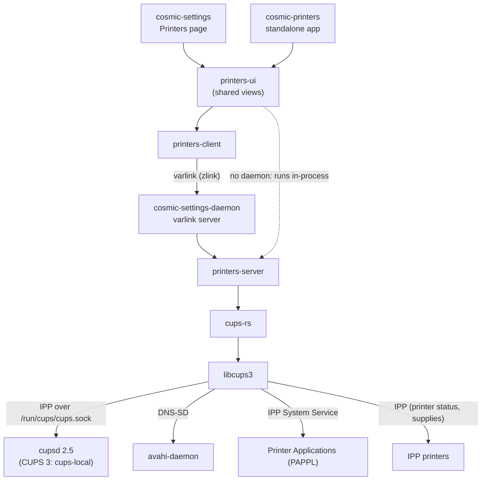

# COSMIC Desktop Printer Setup Tool


- **Contributor:** AbdElRahman Khalifa ([@Abd002](https://github.com/Abd002))
- **Organization:** OpenPrinting (The Linux Foundation)
- **Mentors:** Till Kamppeter, Mintu Gogoi, Michael Murphy, Titiksha Bansal
- **Project page:** [GSoC 2026](<https://summerofcode.withgoogle.com/programs/2026/projects/iYwK7khC>)

**TL;DR:** COSMIC now has a Printers page in Settings and a standalone printers app that share
the same UI. Legacy printers are set up through Printer Applications. On the way I ported
cups-rs to libcups3 and fixed DNS-SD crashes in libcups. 7 PRs merged upstream, the COSMIC
Settings and daemon PRs are in review.

## About the project

This project adds a Printers page to COSMIC Settings and an Add Printer flow for legacy or
specialty printers. There is also a standalone printers app. Both use the same UI code, so any
feature added later shows up in both at the same time.

It follows the new Linux printing architecture: driverless printing over IPP, with legacy
printers set up through Printer Applications instead of PPD drivers.

## Goals

1. Printers page in COSMIC Settings. **Done**, in review.
2. Add Printer flow for legacy and specialty printers through Printer Applications. **Done**, in
   review.
3. A backend layer that keeps the UI stable while CUPS and the Rust bindings change. **Done**,
   `printers-server` behind varlink.
4. Standalone printers app sharing the same UI. **Done**.

## Demo

https://github.com/user-attachments/assets/70d27820-5cb4-40ab-914e-1141e38faed1

More in [pop-os/cosmic-settings#2182](https://github.com/pop-os/cosmic-settings/pull/2182).

## Features

- Printers grouped by physical printer, remote host or Printer Application
- Printer details: state and what's wrong, supply levels, name, location
- Open the printer's own web page
- Change location, delete a printer
- Set my default printer and default options
- Print queue: pause, resume, cancel, move a job to another printer
- Print a test page
- Live updates, no refresh button
- Add Printer: if a legacy printer is discovered, set it up through an installed Printer
  Application. If not, choose Add manually, which opens the Printer Application's web page
  where you add its ip:port. Later this will be built into the dialog.

## How it works



- **cosmic-settings** shows the Printers page. It never calls CUPS itself, it asks
  cosmic-settings-daemon over varlink.
- **cosmic-settings-daemon** runs `printers-server`. cups-rs is FFI into C, so keeping it in a
  separate process means a crash there can't take Settings down.
- **Standalone app** uses the daemon if it's running, otherwise it runs `printers-server` inside
  the app.
- **Runtime:** cupsd 2.5 and avahi-daemon. libcups3 is built with
  `--with-domainsocket=/run/cups/cups.sock` so it can reach cupsd 2.5. With CUPS 3, cupsd
  will be replaced by cups-local, and libcups3 finds it by itself.

### Adding a printer

- **Driverless printer:** nothing to add. It shows on the Printers page once it's found, and
  CUPS makes a temporary queue for it when you print.
- **Legacy printer:** Add Printer finds the Printer Application that supports it and creates the
  printer there over IPP. After that it shows up like any driverless printer.

## CUPS today and CUPS 3

CUPS 3 isn't released yet. libcups3 is, so the project already uses it, but it talks to
cupsd 2.5 for now.

| CUPS 2.5 | CUPS 3 |
| --- | --- |
| One `cupsd` for the whole system, runs as root | **cups-local:** a spooler per user, no admin rights needed. This is what the app will talk to<br>**cups-sharing:** a separate server for sharing printers with other machines |
| PPD drivers | No drivers. Printers are driverless or use a Printer Application |

Old drivers still work through Printer Applications that wrap them (Ghostscript, Gutenprint,
HPLIP).

Setting up legacy printers through Printer Applications is already the CUPS 3 way.

## What I did

### 1. cups-rs

cups-rs didn't compile against libcups3. I ported it, so now it builds with both CUPS 2 and
CUPS 3, and added CI that builds both. I also fixed bugs around jobs, destinations and IPP
requests, and added the `cupsdnssd` feature, which binds the libcups3 DNS-SD API. I wrote this
FFI and use it in the cosmic-printers backend.

| PR | Status |
| --- | --- |
| [#18 IPP management operations, scheduler send helper, Printer Application support](https://github.com/OpenPrinting/cups-rs/pull/18) | Merged |
| [#19 Adapt existing API to CUPS 3, CUPS 2 + 3 builds and CI](https://github.com/OpenPrinting/cups-rs/pull/19) | Merged |
| [#20 CUPS-defined ConnectionFlags, connect to a host by IP/port](https://github.com/OpenPrinting/cups-rs/pull/20) | Merged |
| [#21 DNS-SD service discovery](https://github.com/OpenPrinting/cups-rs/pull/21) | Merged |
| [#22 lpoptions support, destination and job fixes](https://github.com/OpenPrinting/cups-rs/pull/22) | Merged |

Before GSoC: [#8](https://github.com/OpenPrinting/cups-rs/pull/8),
[#9](https://github.com/OpenPrinting/cups-rs/pull/9),
[#16](https://github.com/OpenPrinting/cups-rs/pull/16).

### 2. cosmic-printers

[Abd002/cosmic-printers](https://github.com/Abd002/cosmic-printers) has all the printing work.
It talks to CUPS and Printer Applications, discovers printers, groups queues that belong to the
same physical printer, and has the UI shared by Settings and the standalone app.

| Crate | What it does |
| --- | --- |
| `printers-core` | Shared types, grouping of queues into physical devices |
| `printers-client` | Varlink client for the daemon |
| `printers-server` | CUPS, IPP, DNS-SD and Printer Application backend |
| `printers-ui` | Printer list, details, print queue, Add Printer dialog |
| `printers-app` | Standalone `cosmic-printers` app |


### 3. libcups

While writing the DNS-SD FFI I hit crashes inside libcups itself, so I fixed them there instead
of working around them.

| PR | Status |
| --- | --- |
| [#164 Fix crashes in cupsDNSSDDelete() when Avahi fails to initialize](https://github.com/OpenPrinting/libcups/pull/164) | Merged |
| [#165 Fix crashes and a leaked client in the Avahi DNS-SD code](https://github.com/OpenPrinting/libcups/pull/165) | Merged |

### 4. cosmic-settings

[pop-os/cosmic-settings#2182](https://github.com/pop-os/cosmic-settings/pull/2182) adds the
Printers page and the Add Printer flow to COSMIC Settings. (Open)

### 5. cosmic-settings-daemon

[pop-os/cosmic-settings-daemon#188](https://github.com/pop-os/cosmic-settings-daemon/pull/188)
exposes `printers-server` over varlink, so Settings reaches CUPS through IPC and never loads the
C code in the GUI process. (Open)

## Testing

- **Real printers:** HP PageWide Color MFP P77940, HP PageWide Color MFP 780,
  HP LaserJet M402dn and HP LaserJet 700 M712, all driverless. The HP DesignJet 800 doesn't
  advertise IPP, only raw PCL, so I set it up through a Printer Application and got its
  attributes from there. Printer Applications on the same network: Ghostscript, Gutenprint,
  HPLIP, hp-printer-app, LPrint and PostScript.
- **CI:** cosmic-printers checks formatting, clippy and tests on several architectures. It builds
  libcups3, starts CUPS and Avahi, and advertises two `ippeveprinter` printers to test discovery.
  cups-rs CI builds against both CUPS 2 and CUPS 3.

## What I learned

- Desktop GUI programming with iced and libcosmic. The libcosmic community helped me a lot,
  thanks to all of them.
- FFI. I really enjoyed it, and the DNS-SD bindings were the part I liked most. This is how
  browsing looks with the cups-rs DNS-SD API I added:

  ```rust
  let (error_tx, _errors) = mpsc::channel();
  let (browse_tx, found) = mpsc::channel();
  let dnssd = Dnssd::new(error_tx)?;
  let _browser = dnssd.browse("_ipps-system._tcp", None, browse_tx)?;

  for service in found {
      if service.added {
          let resolver = dnssd.resolve_service(&service)?;
          // resolver.try_recv() gives the host, port and TXT records
      }
  }
  ```

- How printing actually works. IPP attributes, what CUPS does, PAPPL, how CUPS 2 and CUPS 3
  differ (cups-local, cups-sharing) and a lot of CUPS internals.
- IPC over D-Bus and varlink with zbus and zlink.
- Reading the source of the libraries I call. When the bug is in the library, fixing it there is
  often easier than working around it, like I did in libcups.
- Building on something that isn't released yet. CUPS 3 isn't out, so I use libcups3 against
  cupsd 2.5 and keep cups-rs building for both CUPS 2 and CUPS 3.

## Challenges

- **Getting started.** It was my first time working on a desktop environment. COSMIC is many
  repos, and at first I didn't know where my code should go.
- **Real hardware.** Before I had real printers I tested with fake ones (`ippeveprinter`),
  which is also what CI uses now. I had read a lot, but talking to a real printer was
  different. Once I tested on real printers the project became much more real and fun for me.
- **Project size.** I didn't see how big it was until my code got messy. I spent a full week
  restructuring it into the crates above.
- **Legacy printers.** Understanding how to talk to Printer Applications and how PAPPL works took
  a lot of research. Setting up my first legacy printer through a Printer Application over IPP
  was the moment I really appreciated the work.

## What's next

These are not additional GSoC goals; they are the areas I would like to continue working on as
ongoing development and contribution to the projects.

- Get the COSMIC Settings and daemon PRs reviewed and merged.
- Implement user-only and system-wide printer profiles, including:
  - Adding printers by IP address and port.
  - Adding a network by IP range for a one-time scan, allowing users to select which discovered
    printers to add.
  - Adding a network by name, which is saved and used to automatically discover printers.
  - Supporting **For me only** and **For everyone** profiles for printers and networks.
- Add a profile management page, including:
  - A **Profile** page with separate **For me** and **For everyone** sections.
  - Viewing and managing added printers and print servers.
  - Viewing and managing added network names.
  - Removing printers, print servers, and networks from the profile.
  - Changing the sharing scope of an entry between **For me** and **For everyone**.
- Add printer filtering and hiding, including:
  - Filtering printers by location.
  - Filtering by printer capabilities such as color, duplex, stapling, and paper sizes.
  - Hiding specific printers through a selectable list (not available yet; I opened
    [an issue](https://github.com/OpenPrinting/cups-local/issues/6) to ask Michael whether this
    feature will be added).
- Move to cups-local once CUPS 3 is out.

I plan to continue contributing to cosmic-printers beyond GSoC. I would like to keep working on the project by fixing reported issues, improving reliability and usability, and adding new features based on user needs and upstream development.

## Try it

On Debian/Ubuntu.

Runtime requirements:

```sh
sudo apt-get install -y cups avahi-daemon
```

Disable `cups-browsed`. It creates its own queues for printers found on the network, which show up next to the printers the app already finds:

```sh
sudo systemctl disable --now cups-browsed
```

Build dependencies:

```sh
sudo apt-get install -y \
  pkg-config \
  clang \
  libclang-dev \
  libglib2.0-dev \
  libxkbcommon-dev \
  build-essential \
  autoconf \
  libavahi-client-dev \
  libnss-mdns \
  libpng-dev \
  libssl-dev \
  zlib1g-dev
```

libcups3 from OpenPrinting/libcups:

```sh
git clone --recurse-submodules https://github.com/OpenPrinting/libcups.git
cd libcups

./configure \
  --prefix=/usr/local \
  --with-domainsocket=/run/cups/cups.sock

make -j"$(nproc)"
sudo make install
sudo ldconfig
```

Run the standalone app:

```sh
git clone https://github.com/Abd002/cosmic-printers
cd cosmic-printers
cargo run -p printers
```

## Thanks

A big thank you to Till Kamppeter for his support and for understanding my situation, as I am
finishing my military service. Thanks also to Michael R Sweet, Michael Murphy and
Maria Komarova.

## Links

- [Abd002/cosmic-printers](https://github.com/Abd002/cosmic-printers)
- [pop-os/cosmic-settings#2182](https://github.com/pop-os/cosmic-settings/pull/2182)
- [pop-os/cosmic-settings-daemon#188](https://github.com/pop-os/cosmic-settings-daemon/pull/188)
- [OpenPrinting/cups-rs](https://github.com/OpenPrinting/cups-rs)
- [OpenPrinting/libcups](https://github.com/OpenPrinting/libcups)
- [GSoC 2026 project page](<https://summerofcode.withgoogle.com/programs/2026/projects/iYwK7khC>)
